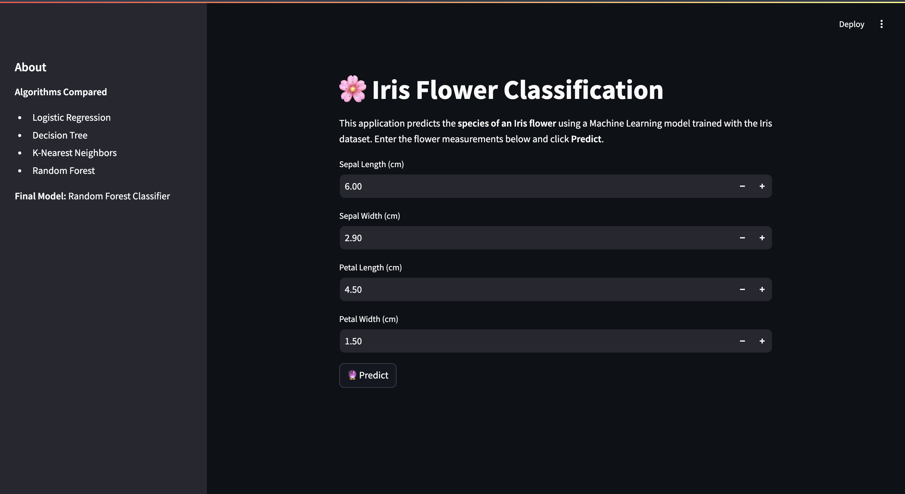
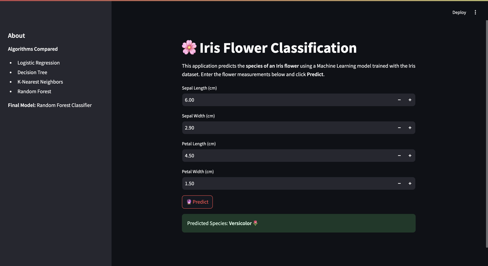
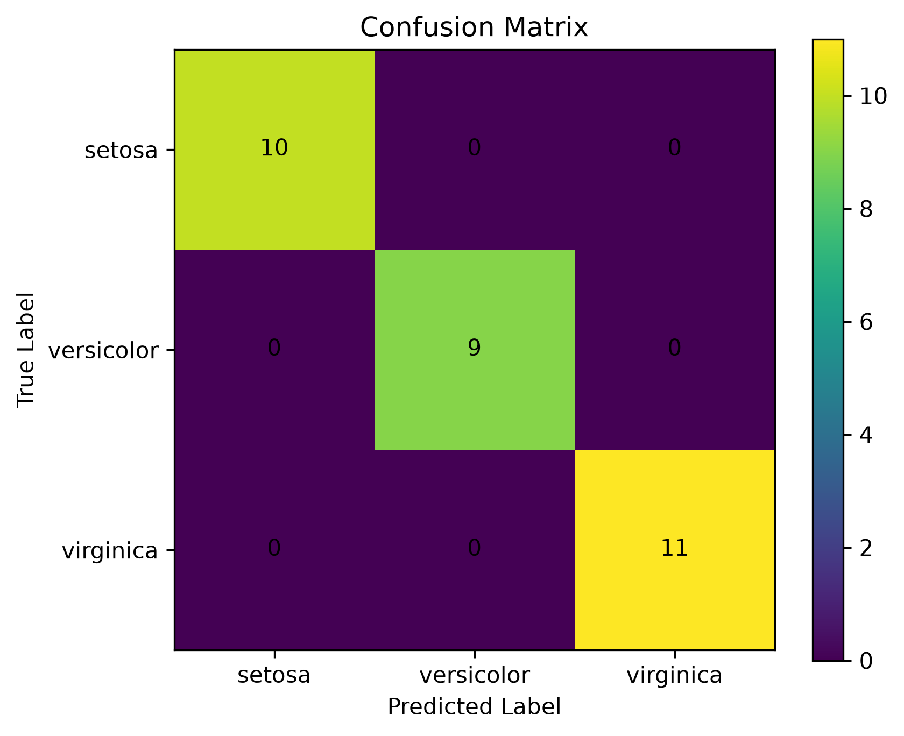

# 🌸 Iris Flower Classification

A Machine Learning web application built using **Python**, **Scikit-learn**, and **Streamlit** that predicts the species of an Iris flower based on its sepal and petal measurements.

---

## 📌 Project Overview

The Iris Flower Classification project uses supervised machine learning to classify flowers into one of three species:

- 🌼 Iris Setosa
- 🌷 Iris Versicolor
- 🌺 Iris Virginica

The application allows users to enter flower measurements through a simple Streamlit interface and instantly predicts the species.

---

## 🚀 Features

- Interactive Streamlit web application
- Machine Learning model trained using Random Forest Classifier
- Comparison of multiple classification algorithms
- Data preprocessing using StandardScaler
- Model evaluation using:
  - Accuracy
  - Confusion Matrix
  - Classification Report
- Clean and beginner-friendly project structure

---

## 🛠️ Technologies Used

- Python
- Pandas
- NumPy
- Matplotlib
- Scikit-learn
- Streamlit
- Joblib

---

## 📂 Project Structure

```
Iris-Flower-Classification/
│
├── dataset/
├── notebook.ipynb
├── train.py
├── app.py
├── model.pkl
├── scaler.pkl
├── requirements.txt
├── README.md
├── images/
└── .gitignore
```

---

## ⚙️ Installation

Clone the repository:

```bash
git clone <repository-link>
```

Move into the project folder:

```bash
cd Iris-Flower-Classification
```

Install dependencies:

```bash
pip install -r requirements.txt
```

Run the application:

```bash
streamlit run app.py
```

---

## 📊 Model Performance

Algorithms Compared:

- Logistic Regression
- Decision Tree
- K-Nearest Neighbors
- Random Forest

Final Model:

- Random Forest Classifier

Model Accuracy:

**100%** (Iris Dataset)

---

## 📷 Screenshots

### Home Page



### Prediction Result

 

### Confusion Matrix

 

---

## 📚 Dataset

The project uses the built-in Iris dataset available in Scikit-learn.

It contains:

- 150 samples
- 4 numerical features
- 3 flower species

---

## 👩‍💻 Author

Anushka Soni